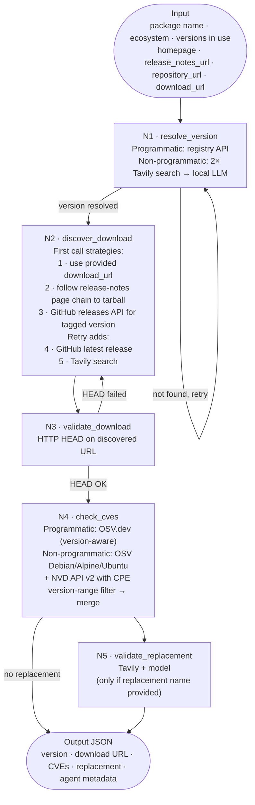

# veripak

CLI tool for auditing open-source packages.

## Install

```bash
pip install veripak
```

## Setup

```bash
veripak config
```

Configures your LLM backend (Ollama, Anthropic, OpenAI, or vLLM self-hosted), Tavily API key, and optional NVD API key.

## Usage

```bash
# Check a single package
veripak check django --ecosystem python

# Include versions in use for CVE matching
veripak check log4j --ecosystem java --versions 2.14.0,2.15.0

# Machine-readable JSON
veripak check openssl --ecosystem c --json

# Skip CVE check (faster)
veripak check requests --ecosystem python --no-cves
```

## How It Works



The agent follows links — navigating from a release-notes page through to an actual tarball URL — rather than relying on search snippet text alone, because snippets frequently omit or truncate the exact versioned download URL needed for verification. Tavily results fed to local models are capped at 3 results with 200-character truncation per snippet to keep context within the working window of small LLMs running through Ollama or a self-hosted vLLM endpoint. Non-programmatic packages (C, C++, system libraries, drivers) are checked against both OSV and NVD because OSV's Debian/Alpine/Ubuntu advisories carry precise version ranges while NVD's CPE dictionary provides broader coverage for upstream projects that don't publish to a package registry; combining the two minimises missed CVEs from either source's blind spots.

## Supported ecosystems

| Ecosystem | Version source | CVE source |
|---|---|---|
| python | PyPI API | OSV.dev |
| javascript | npm registry | OSV.dev |
| java | Maven Central | OSV.dev |
| go | Go proxy | OSV.dev |
| dotnet | NuGet API | OSV.dev |
| perl | MetaCPAN | OSV.dev |
| php | Packagist | OSV.dev |
| c, cpp, system, desktop-app, driver | Tavily + LLM | NVD API |

## LLM backends

veripak uses a local or hosted LLM to extract version information from web search results for non-programmatic ecosystems (C, C++, system packages, etc.).

Supported backends: Ollama (default), Anthropic, OpenAI, vLLM (self-hosted).
